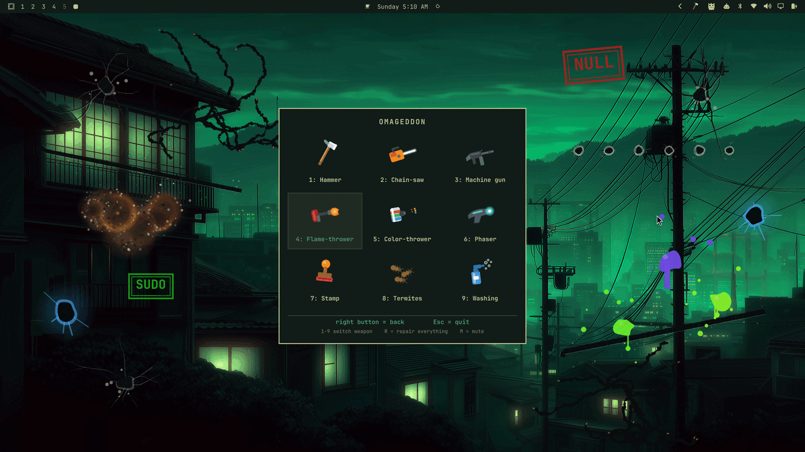

# Omageddon



The Windows XP era desktop-smashing toy, rebuilt as an Omarchy shell plugin.
Nine weapons, a full-screen layer of pure vandalism, and an `R` key that puts
everything back.

Nothing is actually harmed. The damage is paint on a transparent layer above
your desktop — no windows, wallpapers, or files are touched.

## Installing

```bash
omarchy plugin add https://github.com/CrsMthw/omageddon --enable
```

That clones the plugin into `~/.config/omarchy/plugins/` and puts a hammer in
your bar. Needs `qt6-multimedia`, which a stock Omarchy install already has.

For a keyboard launcher, add this to `~/.config/hypr/bindings.lua`:

```lua
o.bind("SUPER + ALT + D", "Omageddon", "omarchy-shell shell toggle io.github.crsmthw.omageddon")
```

Worth having even if you launch from the bar: compositor bindings are handled
before the overlay sees a key, so it is a guaranteed way back out.

## Playing

| | |
|---|---|
| **Launch** | `SUPER + ALT + D`, the hammer in the bar, or `omarchy-shell shell toggle io.github.crsmthw.omageddon` |
| **Fire** | left mouse — one click is one shot; hold for repeat fire, drag to cut or wash |
| **Weapon menu** | right mouse |
| **Switch weapon** | `1`–`9`, or `←` / `→` |
| **Repair everything** | `R`, or middle-click the bar hammer |
| **Mute** | `M` |
| **Quit** | `Esc` |

### The armoury

| | Weapon | How it fires |
|---|---|---|
| 1 | Hammer | One swing per click: a hole and a spray of long cracks |
| 2 | Chain-saw | Drag to cut — a torn gash follows the pointer |
| 3 | Machine gun | Hold to empty the magazine into the desktop |
| 4 | Flame-thrower | Hold to scorch; the burn deepens the longer you linger |
| 5 | Color-thrower | Hold to splatter paint in a fresh colour each time |
| 6 | Phaser | One shot, one molten crater |
| 7 | Stamp | Leaves an inked verdict: `VOID`, `404`, `KERNEL PANIC`… |
| 8 | Termites | Releases a colony that keeps chewing after you let go |
| 9 | Washing | The sponge — erases damage wherever you drag it |

The mess survives quitting. Reopen the game and it is exactly as you left it;
`R` is the only clean slate.

## Removing it

```bash
omarchy plugin remove io.github.crsmthw.omageddon
```

It leaves nothing behind: no state files, no daemons, no autostart entries.
Delete the `o.bind` line from `~/.config/hypr/bindings.lua` if you added one.

## Scope

The overlay claims **one output** — whichever Hyprland has focused when you
launch it — and captures every click and keypress on it. Your other monitors
stay fully usable. If the keyboard ever seems stuck, `SUPER + ALT + D` still
works: compositor bindings are handled before the layer surface sees the key.
`omarchy-shell shell hide io.github.crsmthw.omageddon` closes it from anywhere.

## Scripting

The game answers on its own IPC target, which is how it was built and tested:

```bash
omarchy-shell omageddon open
omarchy-shell omageddon weapon hammer     # or a digit: 1-9
omarchy-shell omageddon hit 800 500       # logical pixels, not physical
omarchy-shell omageddon slash 300 600 1200 700
omarchy-shell omageddon press 800 500     # holds the trigger down
omarchy-shell omageddon release
omarchy-shell omageddon state             # JSON: weapon, decals, fires, termites
omarchy-shell omageddon repair
omarchy-shell omageddon volume 0.3          # 0.0 - 1.0
omarchy-shell omageddon mute
omarchy-shell omageddon close
```

`press`/`release` drive the same trigger the mouse does, including the delay
that separates a click from a hold, so held fire can be tested without a hand
on the button — `hit` deliberately bypasses all of that and fires exactly once.
(That gap is not hypothetical: auto weapons once fired three-round bursts on a
single click for exactly as long as `hit` was the only way anything was tested.)

Coordinates are in the surface's own logical pixels — on a scaled monitor that
is `resolution ÷ scale`, not the pixel count `hyprctl monitors` reports.

## Sound

Every effect is synthesised by [`tools/make-sounds.py`](tools/make-sounds.py) —
nothing is sampled, so there is nothing to license and nothing to attribute,
the same reason the weapons are drawn in code. Edit that script and re-run it
to change them:

```bash
python3 tools/make-sounds.py     # rewrites sounds/*.wav
omarchy restart shell
```

It needs only the Python standard library. Replacing a `.wav` by hand works
just as well — the names are the weapon keys plus `menu`.

Three of them are not one-shots but seamless loops tied to what is happening
on screen, which is what makes those weapons feel continuous rather than
machine-gunned:

| Loop | Runs while |
|---|---|
| `flame_loop` | the flame-thrower trigger is held — one unbroken gas whoosh |
| `ember_loop` | anything is still alight, getting louder the more of it burns |
| `cricket_loop` | a termite colony is loose on screen |
| `water_loop` | the sponge is scrubbing — running water with bubbles in it |

The hammer and the color-thrower each have three interchangeable takes
(`hammer.wav`, `hammer2.wav`, ...), picked at random per swing so repeated
hits do not turn into a metronome. Add takes to any effect by dropping in
`<name>2.wav` and raising its entry in `soundVariants`.

Two of them are worth knowing about if you edit the script:

- **Hammer** is a window breaking — the blow, then a cloud of several dozen
  short inharmonic rings at scattered pitches, thinning out over half a second
  so it reads as shards settling. Glass is a lot of tiny resonances, not
  filtered noise, which is why it is built shard by shard.
- **Color-thrower** is a pressurised squirt and then the splat where it lands.
  Two traps here. A sine sweeping downward in pitch is exactly how a tom drum
  is synthesised, so the splat is made of noise driven through resonant
  filters — the "gloop" is a resonance sliding down, not a pitch — and the
  whole thing is high-passed to leave no drum body behind. The squirt itself
  is built the way the glass shatter is — as a scatter of a dozen or two tiny
  droplet impacts, each a short rising resonance — because a stream leaving a
  nozzle *is* a series of droplets, and filtered noise can be shaped to sweep
  like a squirt but never to be grainy like one.

  Two numbers control how it reads, both in `squirt()`. `density` is droplets
  per second: much above ~250 they overlap three deep and average straight
  back into smooth noise. The bed gain in `lay(bed, 0.0, 0.07)` is the more
  sensitive one — the turbulence bed fills the silence between droplets, so
  at 0.17 the grain is already masked and at 0.0 the droplets are bare and it
  rattles. If the squirt sounds wrong, that gain is the first thing to move.
- **Washing** is a loop, not a shot. A bubble is a short tone that *rises* in
  pitch as it shrinks, so the bubbly part is built from little upward chirps
  scattered through the flow — noise alone only ever gives you hiss. The
  one-shot `wash.wav` survives for "repair everything", which is a single
  event and wants a single swoosh.

Playback needs `qt6-multimedia` (already present on a stock Omarchy install;
without it the overlay will not load at all, since the import is what fails).
It uses QtMultimedia's `SoundEffect`, with a small pool of voices per
effect so rapid fire layers instead of cutting itself off, and a minimum gap
on the pointer-driven weapons (chain-saw, sponge) which would otherwise
retrigger on every mouse move. `M` mutes; `omarchy-shell omageddon
volume 0.3` sets the level for the session.

## How it works

| File | |
|---|---|
| `Overlay.qml` | The overlay: input, state machine, three stacked canvases |
| `Weapons.js` | Decal records and the code that paints them; transient effects |
| `Icons.js` | All nine tools, drawn rather than shipped — menu tiles and cursor |
| `BarWidget.qml` | The hammer in the bar |
| `tools/make-sounds.py` | Synthesises `sounds/*.wav` from scratch |

**Damage is permanent.** Nothing you break is ever un-broken except by the
sponge or `R`. The canvas itself is the damage; the record list beside it is
only a replay log used to rebuild the canvas if the surface is ever lost (a
resize). Each record freezes every random choice made at creation, so a replay
reproduces the same mess pixel for pixel. When the log grows past its memory
bound the oldest entries are forgotten, but the painted pixels are left
untouched — forgetting a record costs nothing visible.

Painting is incremental: only new records are drawn, into their own dirty
rectangle. The fire, insect, and spark layers each clear only the area they
actually cover, and the simulations coalesce their damage repaints, so a busy
screen stays at a steady cost instead of re-uploading a full-screen texture
several times per tick. Frame rates are deliberately not the lever here —
lowering them is immediately visible, while the repainted *area* is not.

### Note for hacking on it

**`.js` edits need `omarchy restart shell`.** The shell hot-reloads a plugin's
`.qml` files on save, but the imported JavaScript stays cached, so changes to
`Weapons.js` or `Icons.js` are silently ignored until the shell restarts. This
is a good way to waste an hour tuning code that is not running — if a drawing
change appears to do nothing, restart before doubting the change.

The `omageddon` IPC target likewise only registers on a full restart.
If a scripted call answers `Target not found` after an edit, restart the shell.
